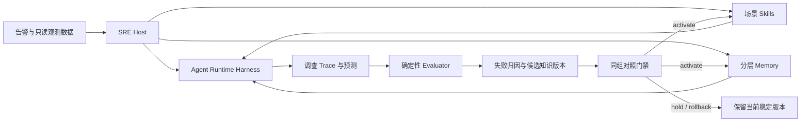

# OpsPilot SRE Agent：知识、记忆、恢复与评测闭环

## 项目目标

OpsPilot 面向云原生故障调查中的真实痛点：值班工程师需要在指标、日志、
Trace、Kubernetes 事件、告警和拓扑之间手工切换，既要理解系统依赖，又要
不断提出和排除假设。项目的目标不是“刷 RCA100”，而是构建一个可复用的
SRE Agent 运行环境：通过场景化 Skills、分层 Memory、可恢复执行和 Eval
驱动反馈闭环，将碎片化观测数据收敛为可复核的根因、传播链和影响证据。

RCA100 是该能力的离线验收环境。评测框架包含 103 个云原生事件、六类观测
数据和 Entity / Fault / Process 三维评分，适合验证调查结果与执行轨迹，但
不能替代生产 MTTR、可用性或人效指标。

## 设计依据

- [Google SRE 的 AI for reliable operations](https://sre.google/resources/practices-and-processes/ai-engineering-reliable-operations/)
  将碎片化遥测、服务知识、历史事件和动态上下文视为智能故障调查的核心输入。
- [Google SRE 有效排障方法](https://sre.google/sre-book/effective-troubleshooting/)
  要求从观测与系统知识形成可证伪假设，避免把相关性直接当成因果关系。
- [DeepAgents Skills](https://docs.langchain.com/oss/python/deepagents/skills)
  使用 `SKILL.md` 元数据进行渐进披露，仅在相关场景读取完整过程知识。
- [DeepAgents Memory](https://docs.langchain.com/oss/python/deepagents/memory)
  将稳定记忆放入 `AGENTS.md`；语义、情景和过程记忆应按作用域管理，复杂合并
  应在后台完成，而不是增加诊断热路径延迟。
- [LangGraph persistence](https://docs.langchain.com/oss/python/langgraph/persistence)
  使用 thread、checkpointer 和 store 支持状态连续性、故障恢复、人工中断和回放。
- [LangSmith evaluation](https://docs.langchain.com/langsmith/evaluation)
  将线上失败 Trace 回流为离线数据集，在候选版本重新部署前执行对照评测。
- [Anthropic Context Engineering](https://www.anthropic.com/engineering/effective-context-engineering-for-ai-agents)
  强调有限上下文、少量高价值工具、结构化笔记和渐进披露，避免上下文腐化。

## 深模块边界



- `services/agent` 是 host-neutral harness，只管理模型、工具、middleware、
  checkpointer、store、sandbox、Trace 和资源关闭；它不知道 RCA100 或 SRE 领域。
- `services/platform` 是可执行 host，拥有 SRE 知识版本、RCA100 工具和入口组合。
- `benchmarks/rca100` 是框架无关 evaluator，只通过 JSON-over-stdio 调用 Agent，
  Agent 退出后才读取受控答案并评分。
- 知识模块使用 DeepAgents 官方 `FilesystemBackend`、`skills=` 和 `memory=`，
  不自研文件加载协议。虚拟根目录只包含经评审的 SRE 知识，模型仅能调用
  `read_file`，不能写入或执行。

这个边界形成一个深模块：Runtime 暴露一个 `RuntimeSpec`，SRE host 暴露一个
版本化知识 profile，Evaluator 暴露一个 artifact 协议；其余生命周期、文件
发现、上下文注入和评分细节都封装在各自模块中。

## 场景化 Skills

RCA100 的受控答案显示故障标签很多，但直接为每个标签编写 Skill 会把 evaluator
知识变成提示词，也无法迁移到生产。`context-v1` 因此只沉淀七条可复用调查路径：

| Skill | 触发场景 | 关键鉴别逻辑 |
| --- | --- | --- |
| Request failure | 错误率、失败事务 | 首个错误实体、调用方向、局部错误与下游传播 |
| Request latency | 延迟、超时 | 首个慢依赖、父子 Span、资源与等待时间 |
| Resource saturation | CPU/内存/磁盘/线程/队列 | 需求、限制和影响的时间顺序 |
| Dependency connectivity | 数据库/缓存/DNS/网络/负载均衡 | 失败依赖边、客户端与服务端起点 |
| Kubernetes availability | Pod/副本/调度/重启/节点 | 事件与状态转换先于业务影响 |
| Traffic anomaly | 流量激增、热点、限流、流量下降 | 总量、分布、容量和重试放大 |
| Change regression | 发布、配置、扩缩容、策略变更 | 变更时刻、差异范围和失败机制共同成立 |

每个 Skill 只描述触发条件、证据优先级、可证伪分支、停止条件和输出约束；不包含
评测 task id、服务名、故障标签、答案数值或固定查询。DeepAgents 先将七条元数据
放入上下文，模型只在匹配场景时读取一条完整 Skill。

## 分层 Memory

| 层级 | 实现 | 生命周期 | 写入策略 |
| --- | --- | --- | --- |
| Working memory | LangGraph thread state + checkpointer；消息、工具 observation、假设和上下文压缩结果 | 单次事件/线程 | 调查过程更新；外部副作用必须幂等 |
| Semantic memory | 只读 `memory/semantic/AGENTS.md`；信号语义、实体规则、证据标准 | 跨事件、版本化 | 仅后台候选经 Eval/人工门禁后发布 |
| Episodic memory | 通过失败 Trace 产出候选 incident record；当前无通过门禁的历史事件，因此不注入 Agent | 跨事件、按环境作用域 | 禁止热路径直接写共享记忆；先去重、脱敏、验证 |
| Procedural memory | 七个 `SKILL.md` | 跨事件、版本化 | 与 Semantic memory 使用同一候选/激活/回滚门禁 |

“没有已验证的 episodic memory”是有效状态，优于把模型猜测或 RCA100 答案当成
长期事实。生产接入时，环境静态信息应按组织/集群作用域只读注入；具体事件原始
遥测仍按需查询，不复制进长期上下文。

## 可恢复执行

恢复分成两个层级：

1. 生产 Agent 由入口选择官方 LangGraph checkpointer。Postgres checkpointer 的
   pool 由 FastAPI lifespan/Runtime owner 一次创建、一次关闭；相同 `thread_id`
   可继续中断前状态。工具副作用必须放入可重放 task，并使用幂等键。
2. 离线 RCA100 每个 case 是独立故障域。Runner 在每条完成后原子写 artifact；
   `--resume` 校验 dataset root、任务集和 variant，跳过已完成项并只重跑错误项。
   进程在单条中断时最多损失该条，不会重复消耗整个分组。

RCA100 的本地 parquet 工具全部只读；同一轮相同参数通过 middleware 证据缓存返回
原结果。因此恢复不会造成外部操作重复，也不依赖提高 recursion limit 掩盖循环。

## Eval 驱动反馈闭环

闭环的输入和激活路径是确定性的：

1. 记录预测、每轮 model/tool 调用、Token、耗时、参数与结果指纹。
2. Agent 退出后，Evaluator 才读取 answer key，计算 Entity / Fault / Process。
3. `compare` 对完全相同的任务集比较 baseline 与 candidate，输出完成率、解析率、
   三项质量得分、总分和调用成本的百分比/百分点变化。
4. 低分 case 只生成缺陷类别和 Trace 定位信息，进入候选反馈，不直接改线上记忆。
5. 候选版本只有在 100% 完成、100% 可解析、100% 可评分，且质量各分量不回退、
   总分达到门槛时才建议 `activate`；回退则建议 `rollback`，证据不足则 `hold`。
6. 实际激活仍是显式版本切换，旧 profile 和 artifact 保留，可一键回滚与复现。

## 首轮验证协议

- 固定模型、temperature、system prompt、九个观测工具、任务顺序和 timeout。
- Baseline 关闭 Skills/Memory；Candidate 只开启 `context-v1`，其他变量不变。
- 使用至少六个跨场景 task 的同组对照，不把答案、taxonomy、故障类型或精确
  checkpoint 数值放入 Agent 上下文。
- 结果必须同时报告质量百分比和成本变化，不用“数据行数”替代准确率。
- 六例只能证明分层、跨场景 smoke 结果，不能宣称 RCA100 全量准确率或生产 MTTR。

复现入口：

```powershell
pnpm benchmark:rca100 -- run `
  --dataset-dir D:\dev\datasets\agenticopseval `
  --tasks t001 t065 t073 t084 t091 t103 `
  --answer-key-dir D:\dev\datasets\agenticopseval-answer-key `
  --variant context-v1 `
  --output artifacts\rca100\context-v1.json `
  --agent-command uv run --project services --package ops-pilot-platform `
    --extra rca100 ops_pilot rca100-agent --knowledge-profile context-v1
```

中断后使用完全相同的命令并额外添加 `--resume`。

## 首轮实验结果与反馈决策

2026-08-17 使用 `deepseek-v4-flash` 对六个跨场景 case
（`t001/t065/t073/t084/t091/t103`）完成同组对照。两组均为 6/6 完成、
100% JSON 解析成功和 100% 可评分；以下是六例均值，不是 RCA100 全量结论：

| 指标 | Baseline | context-v1 | 变化 |
| --- | ---: | ---: | ---: |
| Entity F1 | 50.00% | 33.33% | -16.67 pp |
| Fault score | 0.00% | 16.67% | +16.67 pp |
| Process score | 0.00% | 2.78% | +2.78 pp |
| Final score | 20.00% | 19.17% | -0.83 pp |
| Model calls | 17.33 | 13.83 | -20.19% |
| Tool calls | 38.67 | 33.00 | -14.66% |
| Total tokens | 565,461 | 377,970 | -33.16% |
| Elapsed | 77.93 s | 56.56 s | -27.42% |

`context-v1` 证明渐进披露能减少无效搜索，但不能通过质量门禁：总体得分下降
0.83 pp，Entity 分量下降 16.67 pp，Evaluator 因而给出 `rollback`，没有激活
该知识版本。该结果不包装成“准确率提升”。

失败归因定位到 `t103`：Agent 把下游流量下降误判为流量型根因，并继续扩散查询。
由此生成的 `context-v2` 候选只补充通用的因果先后、调用方/依赖方检查和搜索停止
条件，不写入 case 答案。候选在该 validation case 上由 0% 恢复至 26.67%，但仍
低于 baseline 的 40%，且 Token 比 baseline 增加 36.21%，因此再次 `rollback`，
不继续消耗额度跑全组。

这一轮验证了闭环本身，而不是证明候选知识已经上线：Trace 可以定位成本与质量
退化，候选可以版本化复现，门禁能够拒绝“更省但更错”或“单例改善但仍不达标”
的更新。下一轮应从训练/验证集生成候选，只在未参与归因的 holdout 上决定激活，
避免对六例 smoke set 继续调参。
