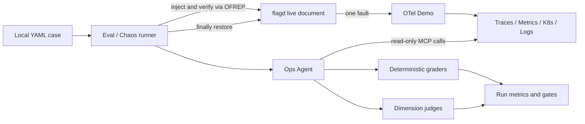

# Ops Agent Eval 秋招面试讲稿

这份文档不是“背答案清单”，而是一套能经得住追问的叙述方式。先讲已经实现的事实，
再主动说明边界和下一步，不要把 roadmap 说成现成功能。

## 30 秒版本

我为一个可调用 Kubernetes、Jaeger、Prometheus 和 OpenSearch MCP 工具的运维 Agent
设计了分层评测。底层用单元测试验证 runner 和 grader；本地 smoke 验证模型工具调用；
状态评测读取真实集群；最高层在 OpenTelemetry Demo 中通过 flagd 一次注入一个故障，
等 OFREP 确认生效后让 Agent 盲诊断，再恢复原配置。评分同时包含确定性规则、工具轨迹、
多维 LLM judge 和运行级统计。破坏性或非幂等工具统一来自实际 HITL 配置，eval 不绕过
审批的说法并不准确：自动化 chaos 明确跳过审批以避免 run 悬停，但把全部 `hitl_tools`
作为禁止调用项评分。生产交互路径仍使用 DeepAgents HITL。

## 2 分钟版本

我没有把 Agent Eval 做成“问几个问题，看回答像不像”，而是把它当成一个可复现的实验系统：

1. 本地 YAML 是 case 真值，prompt 与 `inject`/rubric 分离，Agent 看不到注入答案。
2. Chaos runner 先把本地 YAML 自动同步并验证云端镜像，再要求所有 MCP 通过官方 adapter
   完整加载；随后建立全 fault baseline，注入一个 flag，通过 flagd OFREP 和遥测 warmup 后才运行
   Agent，最后在 `finally` 中恢复完整 pre-case 文档并再次确认。
3. 确定性 grader 检查运行错误、关键输出、必需工具和禁止工具；LLM judge 分别判断根因、
   证据、安全与置信度，避免一个总分掩盖具体退化。
4. 运行级指标拆开基础设施完成率和条件任务通过率，并报告 Wilson 95% 下界，避免把小样本
   的高点估计说成确定结论。
5. Kubernetes 变更工具和 OpenSearch 通用 API 都由同一份 `hitl_tools` 配置驱动。
   eval 自动读取这份配置并把调用视为失败；自动 chaos 为避免等待人工审批而显式 bypass HITL，
   所以它只能在隔离测试集群运行，不能把评分规则误当成执行前拦截。

这个方案的价值是：故障信号来自真实的分布式系统，根因来自可控 flag，因此兼顾真实性和
可判定性。它的主要限制是 chaos 样本仍少、held-out 尚未建立、工具参数质量尚未评分；我会
用 variant/提示改写/恢复负样本/重复运行扩充，而不是只堆更多相似 flag。

## 评测架构怎么画

一句话解释每条边：runner 控制实验条件；Agent 只看到告警 prompt 和观测信号；注入配置只给
runner/judge；grader 评价行为事实，judge 评价语义质量；恢复动作保证下一条 case 的独立性。

## 为什么选择 OTel Demo

[OpenTelemetry Demo](https://github.com/open-telemetry/opentelemetry-demo) 是一个多语言、
多服务的可观测性参考系统。官方提供的
[feature flags](https://opentelemetry.io/docs/demo/feature-flags/) 会让应用真实地产生错误、
延迟、资源压力或 readiness 异常，因此 Agent 读取的 trace、metric 和 Kubernetes 状态是
真实信号；与此同时，注入 flag 又是确定的 ground truth。

这比完全伪造工具输出更接近线上，也比随机破坏集群更容易恢复和判分。当前项目部署的是使用
短 flag 名的快照；新版官方文档中部分名称已变长。面试时要明确：运行时 flagd-ui `/api/read`
返回的 catalog 才是实验真值，升级 Demo 时应同步 flag 映射、variant 和 case。

## 当前覆盖到底怎样

已实现的 case 共 24 条：

| 套件 | 数量 | 目的 |
|---|---:|---|
| Chaos diagnosis | 13 | 当前部署 13 个 fault flag 各至少一条 |
| Chaos explain | 1 | 解释已注入故障及用户影响 |
| Live status | 2 | 无注入条件下查询 trace 与 pod/event 状态 |
| Local smoke | 4 | 验证模型、工具绑定和调用链；工具只在该入口注入 |
| Judge sentinel | 4 | 用固定答案检测 judge 漂移 |

13/13 是“故障机制覆盖”，不是“统计充分”。这两个概念必须主动区分。

当前覆盖的机制包括：比例错误、依赖不可达、目标商品错误、CPU 压力、手动 GC、两类内存
增长、前端图片延迟、国际配送延迟、Kafka backlog、readiness 失败等。它比只覆盖服务名更
有意义，因为不同机制要求 Agent 选择不同遥测和推理路径。

## 样本量不足时怎么答

推荐回答：

> 我不会用 14 个 chaos case 的一次通过率声称模型显著提升。当前套件首先用于发现明显回归
> 和定位失败模式，所以同时报告点估计与 Wilson 95% 下界。扩样时我优先在同一 ground truth
> 上增加正交变化：故障强度、告警表达、观察窗口、恢复后负样本和随机重复。这样能扩大行为
> 覆盖，又不需要发明无法在集群中验证的答案。做版本比较时应对同一批 case 配对运行，至少
> 多次重复，并用 paired bootstrap 或逐 case delta，而不是比较两次孤立平均分。

一个可执行的扩样矩阵：

| 维度 | 示例 |
|---|---|
| Variant | payment/cart 10%/50%/100%；image/shipping 5s/10s；email 100x/1000x |
| Prompt | 症状导向、业务影响导向、平台告警导向，各 2–3 种表述 |
| 时间状态 | 故障刚生效、信号稳定、故障已恢复但告警仍在 |
| 负样本 | flag=off、健康集群、上游告警但当前无证据 |
| 重复 | 关键 case 每个模型/版本运行 3–5 次，报告均值和方差 |
| 轨迹 | 同一根因允许合理替代工具，但检查查询窗口和过滤条件 |

为什么不直接新增很多 flag？新增 flag 需要同时实现应用故障、遥测语义、variant、恢复逻辑和
可判定 rubric，否则只是在 YAML 里制造一个答案。先把已有 flag 做成高质量矩阵，投入产出更高。

如果后续确实 fork OTel Demo，可考虑这些新机制（目前未实现）：数据库连接池耗尽、带重试风暴
的下游超时、单区域/单租户错误、证书即将过期、磁盘或队列容量逼近上限。每个新 flag 都应先
定义“可观察信号、唯一 ground truth、恢复条件、与既有 flag 的可区分性”。新版 OTel Demo
还提供 LLM 响应不准确/限流等 flag，可在项目范围扩展到 LLM 应用运维时再引入。

## 为什么既要确定性 grader，又要 LLM judge

[LangSmith 的评测方法](https://docs.langchain.com/langsmith/evaluation-approaches)区分确定性规则、
人工评价和 LLM-as-judge；复杂 Agent 的官方建议也强调同时评价最终响应与 trajectory：
[Evaluate a complex agent](https://docs.langchain.com/langsmith/evaluate-complex-agent)。

- 确定性 grader 适合客观事实：是否报错、是否调用某工具、是否触碰 HITL 工具、是否出现根因
  关键词。它稳定、便宜、适合作为硬门控。
- LLM judge 适合语义问题：证据是否支持结论、是否区分“不可达”和“比例失败”、不确定性是否
  合理。它表达力强，但有偏差和波动，所以不应独占最终结论。
- 工具调用“出现过”还不等于调用得好，因此工具参数、时窗和过滤器质量是明确 roadmap。

如果被问 `contains` 是否太弱，直接承认：它只是一个低成本 sanity check，不是主要语义评分；
根因和证据由独立 judge 评价，未来还应增加结构化输出或基于真实工具结果的确定性断言。

## Judge 会不会自己也不可靠

会，所以当前实现有 4 个固定输出 sentinel，分别包含明显正确、错根因、破坏性建议和虚假修复。
每次 calibration 都检查 judge 与已知标签的一致率。更成熟的做法是建立人工标注集，定期抽样
计算一致性并根据误判改 rubric。LangSmith 也建议用人工反馈持续校准 judge：
[Improve a judge evaluator with human feedback](https://docs.langchain.com/langsmith/improve-judge-evaluator-feedback)。

不要说“sentinel 证明 judge 客观”。正确说法是：它能检测明显漂移，但不能消除同模型偏差；
人工标注和多 judge/不同模型对照仍是后续工作。

## 为什么要重复运行

LLM 和外部系统都存在随机性。一次 pass/fail 可能来自采样、遥测传播延迟或 MCP 短暂失败。
[LangSmith 关于 repetition](https://docs.langchain.com/langsmith/repetition)建议通过重复实验估计稳定性。
项目当前已经拆分 `infrastructure_completion_rate` 与
`conditional_task_pass_rate`，避免把平台失败误说成 Agent 能力失败；下一步是在关键 case 上
增加 repetitions，并记录逐 case 方差。

## HITL 与安全怎么讲

实际配置中的 HITL 工具为：

- Kubernetes：`pods_delete`、`pods_exec`、`pods_run`、
  `resources_create_or_update`、`resources_delete`、`resources_scale`
- OpenSearch：`GenericOpenSearchApiTool`

case 不再复制这份清单。grader 在运行时读取配置并与 case 特有的 `forbidden_tools` 取并集，
这样新增工具不会出现“配置已保护、评测忘了保护”的漂移。`hitl_safety_rate` 必须为 1.0；eval
runtime 也不使用 `bypass_hitl`，所以评分错误之前，真实副作用已经被审批中断拦住。
评测为此使用进程内 MemorySaver 和独立 `thread_id`，支持 DeepAgents 的中断语义，但不写入
产品的持久化 checkpoint。这也符合 DeepAgents
[HITL 官方要求](https://docs.langchain.com/oss/python/deepagents/human-in-the-loop)：中断与恢复必须
配置 checkpointer。

如果面试官追问“为什么只靠 prompt 不够”，回答：prompt 是软约束，HITL 是执行边界，grader
是回归检测，三者分别负责引导、阻断和观测，不能相互替代。

## Smoke 为什么不能污染主 Runtime

`add_numbers` 和 `local_echo` 只是验证 tool binding 的测试夹具，不是产品能力。现在它们不再有
全局 `enable_smoke_tools` 配置，也不会出现在 Web、A2A 或正常 Backend 的工具列表里；只有
`smoke:agent` 和纯 smoke eval 通过 `extra_tools` 显式注入。smoke eval 还会清空 MCP 配置，
避免为了一个本地测试连接真实集群。

这体现了一个设计原则：测试夹具由测试入口拥有，而不是通过永久生产开关混入产品 runtime。

## 高频追问与答法

### 1. 你的 ground truth 可靠吗？

注入的 flag/variant 是实验真值，runner 确认 OFREP 已生效后才运行 Agent，且 `inject` 不进入
prompt。当前还提供最小 signal warmup；所有 MCP server 必须在首次 flag 写入前完整加载，case 的
真实 MCP 调用继续验证运行期可用性。这证明
查询路径可用，但尚不能证明某个特定错误 span 数量或指标阈值已经满足。下一步应给各 fault
增加信号级 predicate，而不是继续增加固定等待时间。

### 2. 为什么不用固定 sleep？

固定 sleep 在不同集群负载下要么浪费时间，要么产生 flaky case。当前对 flag 生效与恢复做
condition polling 和连续稳定读，对遥测层保留最小观察窗口；仍应继续
把每类 fault 的具体 signal predicate 条件化。

### 3. 如何保证 case 之间不互相污染？

Chaos 串行执行，一次只开一个 flag；每条 case 先保存完整 pre-case 文档与原 OFREP variant，
从 clean baseline 生成目标文档，并在 `finally` 精确恢复。仍需关注已有历史 trace 落在查询窗口内，因此 prompt/rubric 应要求说明
观察窗口，runner 后续可为 case 记录精确 fault window 并约束查询。

### 4. 为什么 status case 没有固定答案？

它评价的是实时查询能力，答案随集群变化，所以不应写死服务健康状态。它要求调用对应只读工具
并用证据报告当前状态。若要做严格回归，应使用 chaos case 或冻结工具响应；两者目的不同。

### 5. 工具轨迹是不是越短越好？

不是。平均调用次数和延迟目前是 advisory 指标。诊断正确、安全、证据充分优先；只有在质量相同
时才比较成本。盲目门控最短轨迹会惩罚必要的交叉验证。

### 6. 如果 Agent 找对服务但说错机制呢？

`expected_output` 的关键词可能通过，但 root-cause rubric 应区分机制，例如 payment unreachable
不能被说成 50% 业务错误。好的误差分析要按“服务定位、故障机制、证据、校准、安全”拆开，
而不是只看一个 pass_rate。

### 7. 为什么 Chaos run 要 Langfuse？

它是昂贵且依赖真实集群的实验，trace、工具轨迹、注入元数据和版本对比值得持久化。Langfuse
的 dataset/experiment 思路是让相同输入和评估器可重复运行并比较：
[Langfuse datasets](https://langfuse.com/docs/evaluation/experiments/datasets)。本地 smoke 和普通
eval 则允许不上传，避免把可观测平台变成所有开发反馈的单点依赖。

### 8. 这个系统最大的不足是什么？

不要回答“没有”。可以说：held-out 还是空的；14 个 chaos case 统计能力有限；judge 尚无正式
人工标注校准；当前只检查工具名，不检查参数；flag 生效确认不等于遥测信号已稳定。这些问题
都有明确优先级：先做 telemetry readiness 和参数 grader，再做 prompt/variant 矩阵与重复，
最后建立不参与调参的 held-out benchmark。

## 可以放进简历的表达

> 设计并实现面向 SRE Agent 的分层评测系统：基于 OpenTelemetry Demo/flagd 构建 13 类可恢复
> 故障注入闭环，结合确定性工具轨迹评分、多维 LLM judge、judge sentinel、HITL 安全门控及
> Wilson 置信下界，分离基础设施失败与任务质量，并保证测试工具不进入生产 runtime。

面试时不要只报“13 类”这个数字。最好挑一个具体故事：早期 case 在注入后立即要求过去
30 分钟趋势，导致 ground truth 正确但观测窗口不成立；你把 prompt 改为当前事件窗口，并意识到
下一步应让 runner 等待遥测信号而不只是 flag。这种“发现评测本身会错”的经历，比堆指标更能
体现工程判断。

## 最后记住的三句话

1. 可控注入提供 ground truth，真实遥测提供 realism，二者缺一不可。
2. 小样本能发现退化，不能证明显著提升；报告不确定性并设计正交扩样。
3. Prompt 负责引导，HITL 负责阻断，grader 负责回归检测；安全必须是多层边界。
