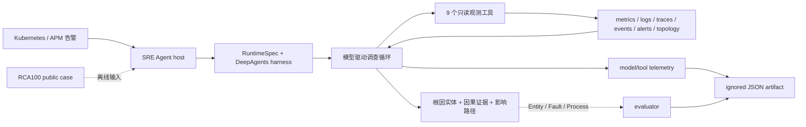

# OpsPilot：可观测数据驱动的云原生故障诊断 Agent

## 可直接写入简历

**项目背景**：面向 Kubernetes 微服务告警，解决 on-call 需要在指标、日志、Trace、事件、告警和拓扑系统之间反复跳转，难以按统一时间窗和实体上下文形成根因证据链的问题。

**职责与结果**：

- 负责 SRE Agent 的运行时与调查链路设计，将 `告警上下文 → 假设生成 → 多模态查询 → 跨服务关联 → 根因实体/传播路径/影响面` 组合为模型驱动的只读工具循环；通用 Agent harness 不依赖 Web 协议或 RCA100 domain，业务能力由 host 通过 tools、context 和 middleware 注入。
- 建设 9 个可观测查询工具，统一 metrics/logs/traces/events/alerts/topology 的时间、实体和状态语义；通过有界查询、错误模式聚合、幂等证据缓存、filesystem deny 和逐轮 telemetry，控制空结果重试、重复调用、上下文膨胀与越权执行。
- 使用 RCA100 `t001` 的 **1,202,614** 行观测数据离线验收：Agent 从 checkout 错误告警定位到 `payment` 根因服务，并关联 `Invalid token` 日志/Trace 证据；相对基线，模型调用 **19→10**、工具调用 **44→27**、Token **499,909→209,354**、时延 **73.86s→50.51s**，根因实体 Precision/Recall **0.50/1.00→1.00/1.00**。

建议项目名：`OpsPilot｜可观测数据驱动的云原生故障诊断 Agent`

建议关键词：`Agent Runtime`、`Task Planning`、`Tool Calling`、`Context Engineering`、`MCP`、`Reliable Execution`、`Agent Observability`、`Agent Evaluation`、`AIOps`、`Kubernetes`。

## 真实场景与 Agent 工程解法

[Google SRE](https://sre.google/resources/practices-and-processes/ai-engineering-reliable-operations/) 将当前故障诊断痛点概括为：工程师需要在碎片化工具间手工关联 metrics、logs 和 traces，增加认知负担并延迟根因定位；AI 系统应围绕具体告警生成假设、验证步骤和相关证据。[OpenTelemetry](https://opentelemetry.io/docs/specs/otel/logs/) 也指出，不同后端、采集方式和数据模型会让日志与指标、Trace 的关联脆弱。

这个场景适合 Agent，而不是固定工作流：故障类型、依赖方向和下一项有效证据无法在运行前完全枚举。模型需要根据上一轮 observation 动态决定下一项工具和参数；可预测的数据加载、权限和评分仍由确定性代码负责。该边界符合 [Anthropic 对 workflow 与 agent 的区分](https://www.anthropic.com/engineering/building-effective-agents)：固定代码路径用于可预测流程，模型驱动的工具选择用于需要灵活决策的任务。

| 关键词 | 在本项目中的准确含义 | 解决的痛点 | 可核验证据 |
| --- | --- | --- | --- |
| Agent Runtime | 持有 model、MCP、checkpointer、sandbox、tracing 的构建与关闭路径 | 资源跨请求泄漏、入口能力混用 | `RuntimeSpec` + async lifecycle |
| Task Planning | system policy 约束调查阶段，模型按 observation 动态选择下一项证据；没有自研独立 planner | 固定 runbook 难覆盖未知故障路径 | model/tool trajectory artifact |
| Tool Calling | Pydantic schema + LangChain `@tool`，参数和返回值有界、可解释 | 参数猜测、空结果重试、返回体挤占上下文 | 9 个只读工具及调用指纹 |
| Context Engineering | 告警、schema 和 case 依赖分层；`ToolRuntime` 隐藏本地依赖，只暴露必要字段 | 把路径、凭据、评测答案或无关数据塞进 prompt | `RCA100Context` 与 answer-key 隔离 |
| MCP | 通用 runtime 可接入 MCP server 的 prompts/resources/tools；RCA100 本地数据走直接 tool injection | domain 能力写死在 Agent harness | MCP registry 与 host composition；不宣称“RCA100 MCP” |
| Memory / Skill | 作为入口级可选能力，不与模型或 runtime 全局绑定 | 不同入口需要不同知识与行为模块 | runtime 已支持；本轮 benchmark 主动关闭，未声称收益 |
| Reliable Execution | 幂等缓存、1h 查询窗、流式日志聚合、只读权限、独立 worker | 无限工具循环、扫描放大、越权副作用 | 完成态 artifact；无 recursion-limit 调参 |
| Observability | 记录每轮 Token、工具名、参数键/指纹、结果规模/指纹和耗时 | 只看到最终答案，无法定位循环与成本增长 | model/tool telemetry |
| Agent Evaluation | 验证最终根因输出，同时比较执行轨迹的调用、Token 和时延 | LLM 非确定性导致改动无法比较 | RCA100 scorer + before/after artifact |

这里没有为了关键词强行加入 Multi-Agent：当前故障调查由一个专用 Agent 和少量高价值工具即可完成。只有在出现可独立并行、具有独立上下文和可单独评分的子任务时，才值得引入多 Agent；这符合“先使用最简单可组合方案，再按业务价值增加复杂度”的 Agent 工程原则。

## 系统边界与数据流



- `services/agent` 只提供 host-neutral harness：模型、工具、middleware、context、persistence 和 lifecycle 的组合接口。
- `services/platform` 持有可执行入口、Web adapter、RCA100 domain 和数据访问。
- 评测 host 注入 prompt、tools、context 与 telemetry；Agent 子进程看不到 `answer_key`，scorer 在子进程结束后读取答案。
- RCA100 worker 关闭 skills、memory、subagent 和 filesystem tool surface，使本轮实验聚焦于工具与运行时契约。

## 我的职责与实现

### 1. 把告警转换为可执行调查链路

SRE system policy 约束调查阶段：先确认影响和时间窗，再映射实体与拓扑，随后提出少量可证伪假设，按需查询观测数据，最后输出 origin → propagation → impact。模型决定下一项查询，确定性代码负责数据范围、权限、schema 和输出校验。

### 2. 把可观测平台能力变成 Agent 可理解的工具

- `query_metric`：告警时刻的有界 Prometheus-style instant vector；
- `query_metric_range`：趋势探索所需的有界 matrix 与统计摘要；
- `query_log_stats` / `query_logs`：先流式聚合 pod、container 和结构化错误模式，再下钻有限原文；
- `query_traces`：按 OpenTelemetry `UNSET / OK / ERROR` 语义查询 span 和父子关系；
- `query_events` / `query_alerts` / `query_topology`：补充变更、告警生命周期和服务依赖证据；
- `list_metric_names`：先发现合法 signal，避免模型猜 metric 名称。

工具使用 LangChain `@tool` 与 Pydantic 生成 JSON Schema；`ToolRuntime[RCA100Context]` 将 case 路径作为执行上下文注入，不出现在模型参数中。返回统一 `{status,data,meta,warnings}` envelope，空结果明确告诉模型应该修改 selector，而不是原样重试。

### 3. 让 Agent 循环可控、可观测、可复核

- DeepAgents `HarnessProfile.excluded_tools` 移除内建 filesystem tools，deny-all `FilesystemPermission` 阻断执行侧读写；
- 相同只读查询命中缓存时返回原始证据，避免“缓存命中但证据丢失”导致二次调用；
- 查询窗口最大 1h，日志统计最多聚合 100,000 条匹配记录，超限显式标记 lower bound；
- benchmark telemetry 记录逐轮 Token、tool、duration、result size 与 SHA-256，不保存工具实参或工具原始返回；
- runner 启动时创建 `running` artifact，每个 task 原子 checkpoint，失败运行同样留档。

这种设计对应 [Anthropic 的 Agent 四层边界](https://www.anthropic.com/research/trustworthy-agents)：model、harness、tools、environment 需要共同约束；只在 prompt 中写“请只读”不能形成执行安全边界。

## RCA100 离线验收

Benchmark 是验收手段，不是项目本身。它验证三件事：Agent 能否结束、是否定位正确实体、工具循环成本是否可度量。

### 数据规模与约束

本地实际可用样本为 RCA100 `t001`：

| 数据面 | 数量 |
| --- | ---: |
| Metrics | 92,155 rows |
| Logs | 600,000 rows |
| Traces | 510,000 rows |
| Events | 449 rows |
| Alerts | 10 rows |
| Topology | 277 entities / 353 edges |
| 合计 | 1,202,614 observation rows |

约束：同一任务、`deepseek-v4-flash`、公开观测数据和 evaluator；Baseline / Final 分别配置 90s / 120s timeout，但均在 74s 内完成。没有把 taxonomy、per-case ground truth 或 `answer_key` 注入 Agent，也没有提高 recursion limit 或硬编码 t001 答案。

### 结果

| 指标 | Baseline | Final | 变化 |
| --- | ---: | ---: | ---: |
| 完成状态 | completed | completed | 均正常结束 |
| Elapsed | 73.8555s | 50.5129s | -31.6% |
| Model calls | 19 | 10 | -47.4% |
| Tool calls | 44 | 27 | -38.6% |
| Total tokens | 499,909 | 209,354 | -58.1% |
| Entity precision | 0.50 | 1.00 | +0.50 |
| Entity recall | 1.00 | 1.00 | 持平 |
| Entity F1 | 0.6667 | 1.0000 | +50.0% |
| Final score | 0.2667 | 0.4000 | +50.0% |

最终输出将 checkout 告警的根因实体收敛为 `payment`，并从日志和 Trace 中提取 `Payment request failed. Invalid token` 证据。这组结果能支持的主张是：**Agent 工具与执行契约降低了单例调查成本，并改善了根因实体定位。** 它不能证明生产 MTTR、线上 QPS 或 103 例总体准确率。

## 可核验证据

| 主张 | 证据 |
| --- | --- |
| 通用 Agent harness / lifecycle | `services/agent/src/ops_pilot/agent/runtime.py` |
| SRE host 与 RCA100 domain 边界 | `services/platform/src/ops_pilot_platform/benchmarks/rca100.py` |
| 六类观测数据工具 | `services/platform/src/ops_pilot_platform/benchmarks/rca100_tools.py` |
| 独立 runner / evaluator | `benchmarks/rca100/src/rca100_benchmark/runner.py`；`scoring.py` |
| Baseline | `artifacts/rca100/2026-08-17-t001-baseline-1f1e0f7.json` |
| Final（正确 harness） | `artifacts/rca100/2026-08-16T18-36-12-217Z-t001.json` |
| SDK 契约失败也留档 | `artifacts/rca100/2026-08-16T18-35-11-268Z-t001.json` |
| 工程门禁 | 根目录 `pnpm check`；standalone RCA100 `ruff + pyright + pytest` |

复现：

```powershell
pnpm benchmark:rca100 -- run `
  --dataset-dir D:\dev\datasets\agenticopseval `
  --task t001 `
  --answer-key-dir D:\dev\datasets\agenticopseval-answer-key `
  --timeout-seconds 120 `
  --agent-command uv run `
    --project D:\dev\projects\ops-agent-platform\services `
    --package ops-pilot-platform --extra rca100 `
    ops_pilot rca100-agent
```

## 现在还没有完成的事

以下内容不写成已交付成果：

1. **Fault / Process 准确率**：最终样本均为 0；公开 Agent 输入尚未提供可用 taxonomy contract，继续针对 t001 写标签映射会造成评测泄漏。
2. **多样本泛化**：本地只有 t001，缺少其余 102 个 case；下一步应先补 5 个不同 fault L1 的公开样本，再统计均值与 P50/P95。
3. **生产收益**：还没有线上 incident 数据，不能宣称 MTTR、可用性或人效提升。
4. **Memory / Skill / Multi-Agent 收益**：runtime 有组合接口，但没有对照实验；不要为了 JD 关键词提前增加复杂度。
5. **Trajectory quality evaluator**：当前已记录轨迹成本，下一步可按 [final response / single step / trajectory](https://docs.langchain.com/langsmith/evaluation-approaches) 分层增加工具选择与参数正确性评分。
6. **上线前安全与规模项**：共享 preview 日志仍需统一 text redactor；artifact 应移除任意 raw stdout；events/metric range 应改为有界 batch 聚合。历史 artifacts 按要求保留在本地 ignored 目录，不对外分发。

## 资料与岗位锚点

- [阿里巴巴 2027 AI SRE](https://www.nowcoder.com/jobs/detail/439655)：SRE Agent、可观测数据、故障诊断、AI-Ready 基础设施、可靠性与 Kubernetes。
- [拼多多 2027 AI Agent 研发](https://www.nowcoder.com/jobs/detail/454245)：任务规划、上下文管理、工具调用、MCP、安全与评测可观测。
- [携程 2027 Agent 开发](https://www.nowcoder.com/jobs/detail/434803)：Agent 框架、记忆、评测、观测与管理。
- [Google SRE：AI Engineering for Reliable Operations](https://sre.google/resources/practices-and-processes/ai-engineering-reliable-operations/)：碎片化观测工具、告警上下文、自动假设与验证证据。
- [Google SRE Incident Management Guide](https://sre.google/resources/practices-and-processes/incident-management-guide/)：自动化影响分析、RCA 和缓解建议，让 on-call 聚焦问题解决。
- [Anthropic：Building Effective Agents](https://www.anthropic.com/engineering/building-effective-agents)：workflow / agent 边界、简单可组合模式、Agent 的成本与延迟权衡。
- [Anthropic：Writing Effective Tools for Agents](https://www.anthropic.com/engineering/writing-tools-for-agents)：tool/ACI 描述、少量高价值工具与基于 eval 的迭代。
- [Model Context Protocol](https://modelcontextprotocol.io/specification/2025-06-18/server/index)：prompts、resources、tools 的控制边界。
- [LangSmith Agent Evaluation](https://docs.langchain.com/langsmith/evaluation-approaches)：最终答案、单步与 trajectory 评测。
- [ASu Resume Skills](https://github.com/Claycui828/ASu-resume-skills)：原子主张、指标口径、角色边界和可验证证据。

实现依据：[LangChain tools](https://docs.langchain.com/oss/python/langchain/tools)、[LangChain middleware](https://docs.langchain.com/oss/python/langchain/middleware/custom)、[Prometheus HTTP API](https://prometheus.io/docs/prometheus/latest/querying/api/)、[OpenTelemetry signals](https://opentelemetry.io/docs/concepts/signals/)、[RCA100](https://www.aiops.cn/gitlab/aiops-live-benchmark/agenticopseval)。
